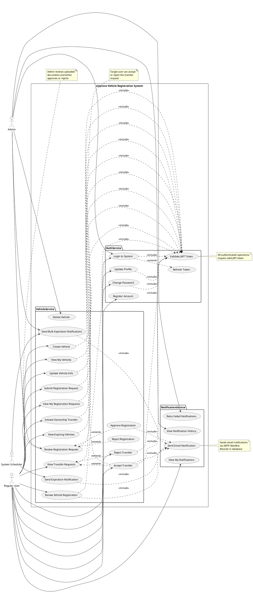

# eUprava Vehicle Registration System - Use Case Diagram

## PlantUML Code



## Detailed Use Case Descriptions

### AuthService Use Cases

#### UC1: Register Account
- **Actor**: Regular User
- **Description**: User creates a new account with username, email, and password
- **Preconditions**: None
- **Postconditions**: User account created with hashed password, default role "User"

#### UC2: Login to System
- **Actor**: Regular User, Admin
- **Description**: User authenticates with username/password, receives JWT tokens
- **Preconditions**: User account exists
- **Postconditions**: Access token and refresh token generated, LastLoginAt updated
- **Includes**: UC5 (Validate JWT Token) - for subsequent requests
- **Extends**: UC6 (Refresh Token) - when access token expires

#### UC3: Update Profile
- **Actor**: Regular User
- **Description**: User updates username or email
- **Preconditions**: User is authenticated
- **Postconditions**: User profile updated
- **Includes**: UC5 (Validate JWT Token)

#### UC4: Change Password
- **Actor**: Regular User
- **Description**: User changes password by providing current and new password
- **Preconditions**: User is authenticated, current password is correct
- **Postconditions**: Password updated with new BCrypt hash
- **Includes**: UC5 (Validate JWT Token)

#### UC5: Validate JWT Token
- **Actor**: System (internal)
- **Description**: Validates JWT token for authentication
- **Preconditions**: Token provided in request header
- **Postconditions**: Token validated, user identity confirmed

#### UC6: Refresh Token
- **Actor**: Regular User
- **Description**: Refreshes expired access token using refresh token
- **Preconditions**: Valid refresh token exists
- **Postconditions**: New access token and refresh token generated

---

### VehicleService Use Cases

#### UC7: Create Vehicle
- **Actor**: Regular User
- **Description**: User adds a new vehicle to the system
- **Preconditions**: User is authenticated
- **Postconditions**: Vehicle created with status "Unregistered", ownership history record created
- **Includes**: UC5 (Validate JWT Token)

#### UC8: View My Vehicles
- **Actor**: Regular User
- **Description**: User views all vehicles they own
- **Preconditions**: User is authenticated
- **Postconditions**: List of user's vehicles displayed
- **Includes**: UC5 (Validate JWT Token)

#### UC9: Update Vehicle Info
- **Actor**: Regular User
- **Description**: User updates vehicle make, model, or year
- **Preconditions**: User owns the vehicle, vehicle is not deregistered
- **Postconditions**: Vehicle information updated
- **Includes**: UC5 (Validate JWT Token)

#### UC10: Delete Vehicle
- **Actor**: Admin
- **Description**: Admin deletes a vehicle from the system
- **Preconditions**: Admin is authenticated
- **Postconditions**: Vehicle removed, related records cascade deleted

#### UC11: Submit Registration Request
- **Actor**: Regular User
- **Description**: User submits request to register/renew vehicle with required documents
- **Preconditions**: User owns vehicle, uploads required documents (Insurance, Inspection, Identity for new; Insurance & Inspection for renewal)
- **Postconditions**: Registration request created with status "Pending"
- **Includes**: UC5 (Validate JWT Token)

#### UC12: View My Registration Requests
- **Actor**: Regular User
- **Description**: User views their submitted registration requests
- **Preconditions**: User is authenticated
- **Postconditions**: List of user's requests with statuses displayed
- **Includes**: UC5 (Validate JWT Token)

#### UC13: Review Registration Request
- **Actor**: Admin
- **Description**: Admin reviews registration request and decides to approve or reject
- **Preconditions**: Admin is authenticated, request exists with status "Pending"
- **Postconditions**: Request reviewed
- **Includes**: UC5 (Validate JWT Token)
- **Extends**: UC14 (Approve) or UC15 (Reject)

#### UC14: Approve Registration
- **Actor**: Admin
- **Description**: Admin approves registration request
- **Preconditions**: Part of UC13
- **Postconditions**:
  - For new registration: Vehicle status changes to "Registered", ExpirationDate set to 1 year
  - For renewal: ExpirationDate extended by 1 year
  - Request status set to "Approved"
- **Includes**: UC24 (Send Email Notification) - notifies vehicle owner

#### UC15: Reject Registration
- **Actor**: Admin
- **Description**: Admin rejects registration request with reason
- **Preconditions**: Part of UC13
- **Postconditions**: Request status set to "Rejected", rejection reason stored

#### UC16: Initiate Ownership Transfer
- **Actor**: Regular User (Current Owner)
- **Description**: Owner creates transfer request to new owner
- **Preconditions**: User owns vehicle, vehicle is active
- **Postconditions**: Transfer request created with status "Pending"
- **Includes**: UC5 (Validate JWT Token)

#### UC17: View Transfer Requests
- **Actor**: Regular User
- **Description**: User views transfer requests (sent and received)
- **Preconditions**: User is authenticated
- **Postconditions**: List of transfer requests displayed
- **Includes**: UC5 (Validate JWT Token)
- **Extends**: UC18 (Accept) or UC19 (Reject) for received requests

#### UC18: Accept Transfer
- **Actor**: Regular User (Target Owner)
- **Description**: Target user accepts ownership transfer
- **Preconditions**: Transfer request exists and is pending
- **Postconditions**:
  - Previous ownership history record closed (ToDate set)
  - New ownership history record created
  - Vehicle OwnerId and OwnerName updated
  - Transfer status set to "Accepted"
- **Includes**: UC24 (Send Email Notification) - notifies both parties

#### UC19: Reject Transfer
- **Actor**: Regular User (Target Owner)
- **Description**: Target user rejects ownership transfer
- **Preconditions**: Transfer request exists and is pending
- **Postconditions**: Transfer status set to "Rejected", no ownership changes

#### UC20: Renew Vehicle Registration
- **Actor**: Regular User, Admin
- **Description**: Extends vehicle registration expiration date
- **Preconditions**: Vehicle is registered
- **Postconditions**:
  - ExpirationDate extended by specified months (default 12)
  - If current expiration is past: extends from today
  - If current expiration is future: extends from that date
- **Includes**: UC5 (Validate JWT Token), UC24 (Send Email Notification)

#### UC21: View Expiring Vehicles
- **Actor**: Regular User
- **Description**: View vehicles with registrations expiring within specified days (default 30)
- **Preconditions**: User is authenticated
- **Postconditions**: List of expiring vehicles displayed
- **Includes**: UC5 (Validate JWT Token)

#### UC22: Send Expiration Notification
- **Actor**: System Scheduler
- **Description**: Automatically sends notification for a specific expiring vehicle
- **Preconditions**: Vehicle registration expiring within threshold
- **Postconditions**: Notification sent to vehicle owner
- **Includes**: UC24 (Send Email Notification)

#### UC23: Send Bulk Expiration Notifications
- **Actor**: Admin, System Scheduler
- **Description**: Send notifications to all vehicles expiring within specified days
- **Preconditions**: Admin authenticated OR automated scheduler trigger
- **Postconditions**: Notifications sent to all affected vehicle owners
- **Includes**: UC24 (Send Email Notification)

---

### NotificationService Use Cases

#### UC24: Send Email Notification
- **Actor**: System (internal - called by VehicleService)
- **Description**: Sends email notification via SMTP and records in database
- **Preconditions**: Recipient email, subject, and message provided
- **Postconditions**:
  - Notification record created with status "Pending"
  - Email sent via SMTP (Mailtrap/Gmail)
  - Status updated to "Sent" or "Failed"

#### UC25: View Notification History
- **Actor**: Admin
- **Description**: View all sent notifications (last 100)
- **Preconditions**: Admin is authenticated
- **Postconditions**: List of notifications displayed with statuses

#### UC26: View My Notifications
- **Actor**: Regular User
- **Description**: User views notifications sent to them
- **Preconditions**: User is authenticated
- **Postconditions**: List of user's notifications displayed

#### UC27: Retry Failed Notifications
- **Actor**: Admin
- **Description**: Retry sending notifications that previously failed
- **Preconditions**: Admin is authenticated, failed notifications exist
- **Postconditions**: Failed notifications retried, statuses updated

---

## Actor Descriptions

### Regular User
- Registers and logs into the system
- Manages their vehicles (create, view, update)
- Submits registration requests
- Initiates and responds to ownership transfers
- Renews registrations
- Views notifications

### Admin
- All Regular User capabilities
- Reviews and approves/rejects registration requests
- Deletes vehicles
- Views all notification history
- Sends bulk notifications
- Retries failed notifications

### System Scheduler
- Automated background process
- Checks for expiring registrations daily
- Sends automated notifications

---

## Use Case Dependencies

### Include Relationships (<<include>>)
- Most authenticated operations include **UC5: Validate JWT Token**
- Operations that notify users include **UC24: Send Email Notification**

### Extend Relationships (<<extend>>)
- **UC13: Review Registration Request** extends to **UC14: Approve** or **UC15: Reject**
- **UC17: View Transfer Requests** extends to **UC18: Accept** or **UC19: Reject**
- **UC2: Login** extends to **UC6: Refresh Token** when token expires

---

## Inter-Service Communication Flow

```
┌──────────────┐         ┌──────────────┐         ┌──────────────┐
│ VehicleService│         │ AuthService  │         │Notification  │
│              │         │              │         │   Service    │
└──────┬───────┘         └──────┬───────┘         └──────┬───────┘
       │                        │                        │
       │  Validate Token        │                        │
       │───────────────────────>│                        │
       │                        │                        │
       │  Get User Email        │                        │
       │───────────────────────>│                        │
       │                        │                        │
       │  Send Notification     │                        │
       │────────────────────────────────────────────────>│
       │                        │                        │
```

---

## How to Render PlantUML

1. **Online**: Copy the PlantUML code to https://www.plantuml.com/plantuml/uml/
2. **VS Code**: Install "PlantUML" extension
3. **IntelliJ/Rider**: Built-in PlantUML support
4. **CLI**: Save as `.puml` file and run `plantuml filename.puml`
