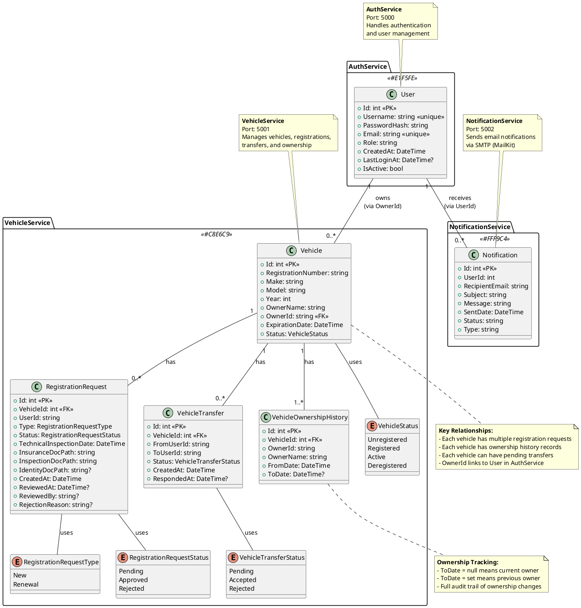

# eUprava Vehicle Registration System - Class Diagram

## PlantUML Code



## Visual Representation (Text-Based)

```
┌──────────────────────────────────────────────────────────────────┐
│                    AUTHSERVICE (Port 5000)                       │
│  ┌────────────────┐                                              │
│  │     User       │                                              │
│  ├────────────────┤                                              │
│  │ Id (PK)        │                                              │
│  │ Username       │                                              │
│  │ PasswordHash   │                                              │
│  │ Email          │                                              │
│  │ Role           │                                              │
│  │ CreatedAt      │                                              │
│  │ LastLoginAt    │                                              │
│  │ IsActive       │                                              │
│  └────────────────┘                                              │
└────────────┬─────────────────────────────────────────────────────┘
             │ owns (via OwnerId)
             │ receives notifications (via UserId)
             │
┌────────────┴─────────────────────────────────────────────────────┐
│                  VEHICLESERVICE (Port 5001)                      │
│  ┌─────────────────┐          ┌──────────────────────┐          │
│  │    Vehicle      │◄────────┤ RegistrationRequest  │          │
│  ├─────────────────┤ 1     * ├──────────────────────┤          │
│  │ Id (PK)         │          │ Id (PK)              │          │
│  │ RegistrationNum │          │ VehicleId (FK)       │          │
│  │ Make            │          │ UserId               │          │
│  │ Model           │          │ Type                 │          │
│  │ Year            │          │ Status               │          │
│  │ OwnerName       │          │ TechnicalInspDate    │          │
│  │ OwnerId (FK)    │          │ InsuranceDocPath     │          │
│  │ ExpirationDate  │          │ InspectionDocPath    │          │
│  │ Status          │          │ IdentityDocPath      │          │
│  └─────────────────┘          │ CreatedAt            │          │
│         │                     │ ReviewedAt           │          │
│         │                     │ ReviewedBy           │          │
│         │ 1                   │ RejectionReason      │          │
│         │                     └──────────────────────┘          │
│         │                                                        │
│         │        *            ┌──────────────────────┐          │
│         └────────────────────►│  VehicleTransfer     │          │
│         │                     ├──────────────────────┤          │
│         │                     │ Id (PK)              │          │
│         │                     │ VehicleId (FK)       │          │
│         │                     │ FromUserId           │          │
│         │                     │ ToUserId             │          │
│         │                     │ Status               │          │
│         │                     │ CreatedAt            │          │
│         │                     │ RespondedAt          │          │
│         │                     └──────────────────────┘          │
│         │                                                        │
│         │        *            ┌──────────────────────┐          │
│         └────────────────────►│ VehicleOwnership     │          │
│                               │ History              │          │
│                               ├──────────────────────┤          │
│                               │ Id (PK)              │          │
│                               │ VehicleId (FK)       │          │
│                               │ OwnerId              │          │
│                               │ OwnerName            │          │
│                               │ FromDate             │          │
│                               │ ToDate (nullable)    │          │
│                               └──────────────────────┘          │
└──────────────────────────────────────────────────────────────────┘

┌──────────────────────────────────────────────────────────────────┐
│               NOTIFICATIONSERVICE (Port 5002)                    │
│  ┌─────────────────┐                                             │
│  │  Notification   │                                             │
│  ├─────────────────┤                                             │
│  │ Id (PK)         │                                             │
│  │ UserId          │◄─── Links to User.Id (AuthService)         │
│  │ RecipientEmail  │                                             │
│  │ Subject         │                                             │
│  │ Message         │                                             │
│  │ SentDate        │                                             │
│  │ Status          │                                             │
│  │ Type            │                                             │
│  └─────────────────┘                                             │
└──────────────────────────────────────────────────────────────────┘
```

## Entity Descriptions

### AuthService

**User**
- Core entity for authentication and authorization
- Stores hashed passwords (BCrypt)
- Supports roles: "User" and "Admin"
- Tracks login activity and account status

### VehicleService

**Vehicle**
- Main entity for vehicle information
- Links to User via `OwnerId` (cross-service relationship)
- Status enum tracks registration state (Unregistered → Registered → Active/Deregistered)

**RegistrationRequest**
- Handles new registrations and renewals
- Stores document paths for uploaded files
- Admin reviews and approves/rejects requests
- Cascade delete when vehicle is deleted

**VehicleTransfer**
- Manages ownership transfer workflow
- Pending status until target user accepts/rejects
- Cascade delete when vehicle is deleted

**VehicleOwnershipHistory**
- Complete audit trail of all ownership changes
- `ToDate = null` indicates current owner
- `ToDate != null` indicates previous owner
- Cascade delete when vehicle is deleted

### NotificationService

**Notification**
- Stores all sent notifications (email)
- Tracks delivery status (Pending/Sent/Failed)
- Links to User via `UserId` (cross-service relationship)
- Supports future expansion to SMS

## Key Relationships

### Within VehicleService
- **Vehicle → RegistrationRequest** (1:N, Cascade Delete)
- **Vehicle → VehicleTransfer** (1:N, Cascade Delete)
- **Vehicle → VehicleOwnershipHistory** (1:N, Cascade Delete)

### Cross-Service (Logical)
- **User → Vehicle** (1:N via OwnerId string)
- **User → Notification** (1:N via UserId int)

## Enums

**VehicleStatus**: Unregistered, Registered, Active, Deregistered
**RegistrationRequestType**: New, Renewal
**RegistrationRequestStatus**: Pending, Approved, Rejected
**VehicleTransferStatus**: Pending, Accepted, Rejected

## How to Render PlantUML

1. **Online**: Copy the PlantUML code to https://www.plantuml.com/plantuml/uml/
2. **VS Code**: Install "PlantUML" extension, then right-click and select "Preview Current Diagram"
3. **IntelliJ/Rider**: Built-in PlantUML support
4. **CLI**: Save as `.puml` file and run `plantuml filename.puml`
